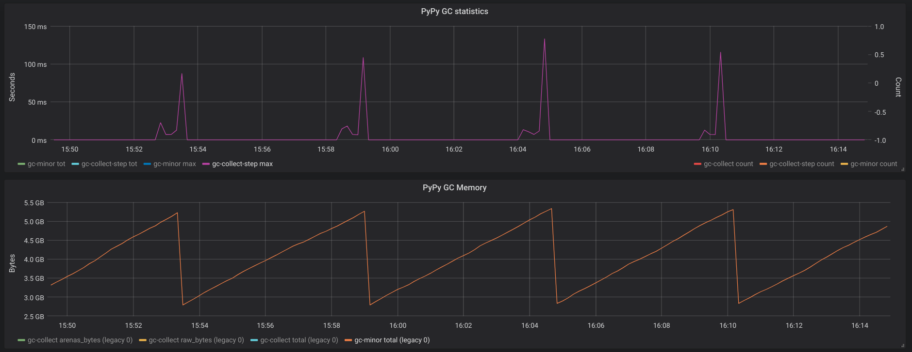
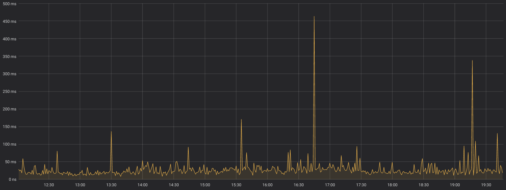
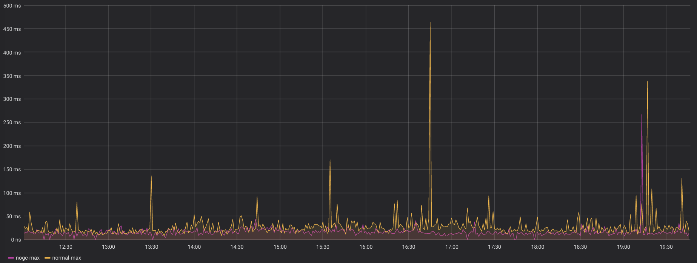

PyPy for low-latency systems
=============================

Recently I have merged the gc-disable branch, introducing a couple of features
which are useful when you need to respond to certain events with the lowest
possible latency.  This work has been kindly sponsored by `Gambit Research`_
(which, by the way, is a very cool and geeky place where to work_, in case you
are interested).

The PyPy VM manages memory using a generational, moving Garbage Collector.
Periodically, the GC scans the whole heap to find unreachable objects and
frees the corresponding memory.  Although at a first look this strategy might
sound expensive, in practice the total cost of memory management is far less
than e.g. on CPython, which is based on reference counting.  While maybe
counter-intuitive, the main advantage of a non-refcount strategy is 
that allocation is very fast (especially compared to malloc-based allocators),
and deallocation of objects which die young is basically for free. More
information about the PyPy GC is available here_.

As we said, the total cost of memory managment is less on PyPy than on
CPython, and it's one of the reasons why PyPy is so fast.  However, one big
disadvantage is that while on CPython the cost of memory management is spread
all over the execution of the program, on PyPy it is concentrated into GC
runs, causing observable pauses which interrupt the execution of the user
program.

To avoid excessively long pauses, the PyPy GC has been using an `incremental
strategy`_ since 2013. The GC runs as a series of "steps", letting the user
program to progress between each step.

The following chart shows the behavior of a real-world, long-running process:

The orange line shows the total memory used by the program, which
increases linearly while the program progresses. Every ~5 minutes, the GC
kicks in and the memory usage drops from ~5.2GB to ~2.8GB (this is controlled
by the PYPY_GC_MAJOR_COLLECT_ env variable).

The purple line shows aggregated data about the GC timing: the whole
collection takes ~1400 individual steps over the course of ~1 minute: each
point represent the **maximum** time a single step took during the past 10
seconds. Most steps take ~10-20 ms, although we see a horrible peak of ~100 ms
towards the end. We have not investigated yet what it is caused by, but we
suspect it is related to the deallocation of raw objects.

These multi-millesecond pauses are a problem for systems where it is important
to respond to certain events with a latency which is both low and consistent.
The GC kicks in at the wrong time, it might causes unacceptable pauses during
the collection cycle.

Let's look again at our real-world example. This is a system which
continuously monitors an external stream; when a certain event occurs, we want
to take an action. The following chart shows the maximum time it takes to
complete one of such actions, aggregated every minute:

You can clearly see that the baseline response time is around ~20-30
ms. However, we can also see periodic spikes around ~50-100 ms, with peaks up
to ~350-450 ms! After a bit of investigation, we concluded that most (although
not all) of the spikes were caused by the GC kicking in at the wrong time.

The work I did in the ``gc-disable`` branch aims to fix this problem by
introducing `two new features`_ to the ``gc`` module:

  - ``gc.disable()``, which previously only inhibited the execution of
    finalizers without actually touching the GC, now disables the GC major
    collections. After a call to it, you will see the memory usage grow
    indefinitely.

  - ``gc.collect_step()`` is a new function which you can use to manually
    execute a single incremental GC collection step.

Combining these two functions, it is possible to take control of the GC to
make sure it runs only when it is acceptable to do so.  For an example of
usage, you can look at the implementation of a `custom GC`_ inside pypytools_.
The peculiarity is that it also defines a ``with nogc():`` context manager
which you can use to mark performance-critical sections where the GC is not
allowed to run.

The following chart compares the behavior of the default PyPy GC and the new
custom GC, after a careful placing of ``nogc()`` sections:

The yellow line is the same as before, while the purple line shows the new
system: almost all spikes have gone, and the baseline performance is about 10%
better. There is still one spike towards the end, but after some investigation
we concluded that it was **not** caused by the GC.

All in all, a pretty big success, I think.  These functionalities are already
available in the nightly builds of PyPy, and will be included in the next
release: take this as a Christmas present :)

Antonio Cuni and the PyPy team

.. _`Gambit Research`: https://www.gambitresearch.com/
.. _work: https://www.gambitresearch.com/jobs.html
.. _here: https://pypy.readthedocs.io/en/latest/gc_info.html#incminimark
.. _`incremental strategy`: https://morepypy.blogspot.com/2013/10/incremental-garbage-collector-in-pypy.html
.. _PYPY_GC_MAJOR_COLLECT: https://pypy.readthedocs.io/en/latest/gc_info.html#environment-variables
.. _`two new features`: https://pypy.readthedocs.io/en/latest/gc_info.html#semi-manual-gc-management
.. _`Custom GC`: https://bitbucket.org/antocuni/pypytools/src/0273afc3e8bedf0eb1ef630c3bc69e8d9dd661fe/pypytools/gc/custom.py?at=default&fileviewer=file-view-default
.. _pypytools: https://pypi.org/project/pypytools/
