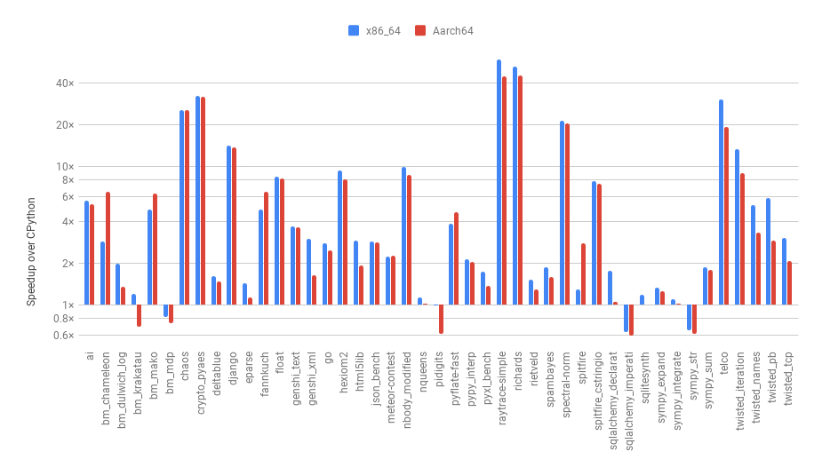
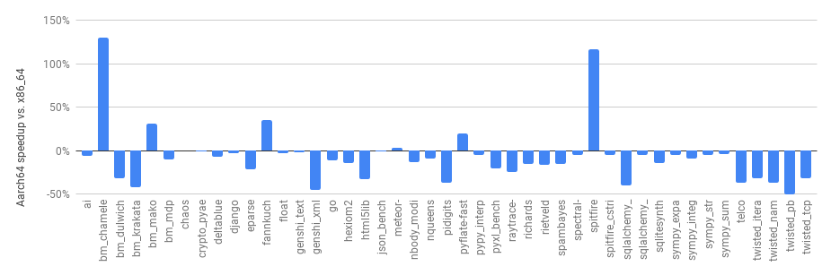

Hello everyone.

We are pleased to announce the availability of the new PyPy for AArch64. This
port brings PyPy's high-performance just-in-time compiler to the AArch64
platform, also known as 64-bit ARM. This work was funded by ARM Holdings Ltd.
and Crossbar.io.

To show how well the new PyPy port performs, we compare the performance of PyPy
against CPython on a set of benchmarks. As a point of comparison, we include the
results of PyPy on x86_64. Note, however, that the results presented here were
measured on a Graviton A1 machine from AWS, which comes with a very serious
word of warning: Graviton A1's are
virtual machines and as such, are not suitable for benchmarking. If someone
has access to a beefy enough (16G) ARM64 server and is willing to give
us access to it, we are happy to redo the benchmarks on a real machine.
Our main concern here is that while a virtual CPU is 1-to-1 with a real CPU, it's
not clear to us how caches are shared, and how they cross CPU boundaries.

The following graph shows the speedup of PyPy (hg id 2417f925ce94) compared to
CPython (2.7.15) on AArch64, as well as the speedups on a x86_64 Linux laptop,
comparing the most recent release, PyPy 7.1.1, to CPython 2.7.16.

In the majority of benchmarks, the speedups achieved on AArch64 match those
achieved on the x86_64 laptop. Over CPython, PyPy on AArch64 achieves speedups
between 0.6x to 44.9x. These speedups are comparable to x86_64, where they are
between 0.6x and 58.9x.

The next graph compares between the speedups achieved on AArch64 to the speedups
achieved on x86_64, i.e., how much the speedup is on AArch64 vs. the same
benchmark on x86_64. Note that by no means is this benchmark suite
representative enough to average the results. Read the numbers individually per
benchmark.

Note also that we see a wide variance. There are generally three groups of
benchmarks - those that run at more or less the same speed, those that
run at 2x the speed and those that run at 0.5x the speed of x86_64.

The variance and disparity are likely related to a variety of issues, mostly due
to differences in architecture. What *is* however interesting is that compared
to measurements performed on older ARM boards, the branch predictor on the
Graviton A1 machine appears to have improved. As a result, the speedups achieved
by PyPy over CPython are smaller: "sophisticated" branchy code, like CPython
itself, simply runs a lot faster.

One takeaway here is that there is a lot of improvement left to be done
in PyPy. This is true for both of the above platforms, but probably more
so for AArch64, which comes with a large number of registers. The PyPy
backend was written with x86 (the 32-bit variant) in mind, which is very
register poor. We think we can improve somewhat in the area of emitting
more modern machine code, which should have more impact for AArch64
than for x86_64. There are also still a few missing features in the AArch64
backend, which are implemented as calls instead of inlined instructions;
something we hope to improve.

Best,
Maciej Fijalkowski, Armin Rigo and the PyPy team
