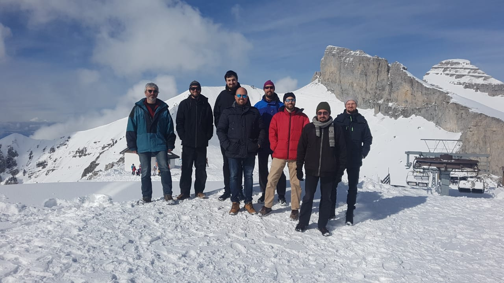

Leysin 2020 Sprint Report
=========================

At the end of February ten of us gathered in Leysin, Switzerland to work on
a variety of topics including HPy_, `PyPy Python 3.7`_ support and the PyPy
migration to Heptapod_.

We had a fun and productive week. The snow was beautiful. There was skiing
and lunch at the top of Berneuse_, cooking together, some late nights at
the pub next door, some even later nights coding, and of course the
obligatory cheese fondue outing.

There were a few of us participating in a PyPy sprint for the first time
and a few familiar faces who had attended many sprints. Many different
projects were represented including PyPy, HPy_, GraalPython_,
Heptapod_, and rust-cpython_. The atmosphere was relaxed and welcoming, so if
you're thinking of attending the next one -- please do!

Topics worked on:

HPy
---

HPy is a new project to design and implement a better API for extending
Python in C. If you're unfamiliar with it you can read more about it at
HPy_.

A lot of attention was devoted to the Big HPy Design Discussion which
took up two full mornings. So much was decided that this will likely
get its own detailed write-up, but bigger topics included:

* the HPy GetAttr, SetAttr, GetItem and SetItem methods,
* HPy_FromVoidP and HPy_AsVoidP for passing HPy handles to C functions
  that pass void* pointers to callbacks,
* avoiding having va_args as part of the ABI,
* exception handling,
* support for creating custom types.

Quite a few things got worked on too:

* implemented support for writing methods that take keyword arguments with
  HPy_METH_KEYWORDS,
* implemented HPy_GetAttr, HPy_SetAttr, HPy_GetItem, and HPy_SetItem,
* started implementing support for adding custom types,
* started implementing dumping JSON objects in ultrajson-hpy,
* refactored the PyPy GIL to improve the interaction between HPy and
  PyPy's cpyext,
* experimented with adding HPy support to rust-cpython.

And there was some discussion of the next steps of the HPy initiative
including writing documentation, setting up websites and funding, and
possibly organising another HPy gathering later in the year.

PyPy
----

* Georges gave a presentation on the Heptapod topic and branch workflows
  and showed everyone how to use hg-evolve.

* Work was done on improving the PyPy CI buildbot post the move to
  heptapod, including a light-weight pre-merge CI and restricting
  when the full CI is run to only branch commits.

* A lot of work was done improving the -D tests.

Miscellaneous
-------------

* Armin demoed VRSketch and NaN Industries in VR, including an implementation
  of the Game of Life within NaN Industries!

* Skiing!

Aftermath
---------

Immediately after the sprint large parts of Europe and the world were
hit by the COVID-19 epidemic. It was good to spend time together before
travelling ceased to be a sensible idea and many gatherings were cancelled.

Keep safe out there everyone.

The HPy & PyPy Team & Friends

*In joke for those who attended the sprint: Please don't replace this blog post
with its Swedish translation (or indeed a translation to any other language :).*

.. _HPy:  https://github.com/pyhandle/hpy/
.. _PyPy Python 3.7: http://buildbot.pypy.org/summary?branch=py3.7
.. _Heptapod: https://foss.heptapod.net/pypy/
.. _Berneuse: https://en.wikipedia.org/wiki/Berneuse
.. _GraalPython: https://github.com/graalvm/graalpython
.. _rust-cpython_: https://github.com/dgrunwald/rust-cpython
